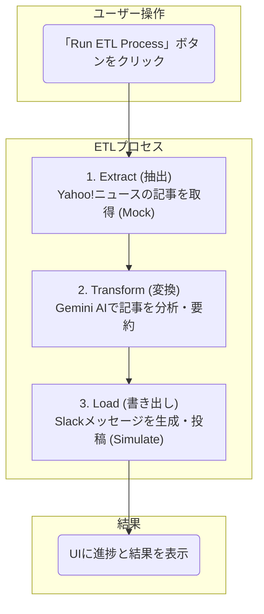

<div align="center">

</div>

# AI ETL Agent: News to Slack

このアプリケーションは、ニュース記事を取得し、Gemini AI を使って分析・要約し、その結果をSlackに投稿する、という一連のETL (Extract, Transform, Load) プロセスを可視化するためのデモアプリケーションです。

AI Studioでこのアプリを見る: https://ai.studio/apps/drive/11Vwu7xVOHsMmfslq1c8vJMcJj_0enz-P

## 概要

「Run ETL Process」ボタンをクリックすると、以下の処理が実行され、各ステップの進捗と結果がリアルタイムで画面に表示されます。

1.  **Extract (抽出)**: Yahoo!ニュースから最新のトップニュース5件を模擬的に取得します。
2.  **Transform (変換)**: Google Gemini API を利用して、取得したニュース記事を分析し、「トピック分類」と「内容の要約」を生成します。
3.  **Load (書き出し)**: 分析結果をSlackのメッセージ形式に整形し、Slackへの投稿をシミュレートします。

## 処理フロー



## 主な使用技術

-   **フロントエンド**: React, TypeScript
-   **ビルドツール**: Vite
-   **AI**: Google Gemini API (`@google/genai`)
-   **UI**: Tailwind CSS

## ローカルでの実行方法

**前提条件:**

-   [Node.js](https://nodejs.org/) がインストールされていること。
-   Google Gemini API キーを取得していること。

**手順:**

1.  **依存関係のインストール:**
    ```bash
    npm install
    ```

2.  **APIキーの設定:**
    プロジェクトのルートディレクトリに `.env` ファイルを作成し、以下のようにご自身のGemini APIキーを設定してください。

    ```
    VITE_GEMINI_API_KEY=YOUR_GEMINI_API_KEY
    ```

3.  **開発サーバーの起動:**
    ```bash
    npm run dev
    ```

4.  ブラウザで `http://localhost:5173` （またはターミナルに表示されたアドレス）にアクセスすると、アプリケーションが表示されます。

---

## 開発メモ (Development Memo)

開発の進捗と計画を記録するためのメモです。

### 完了したタスク (2025-10-09)

- **バックエンドサーバーの導入:**
  - セキュリティ強化と将来の機能拡張のため、Node.js (Express + TypeScript) を使用したバックエンドサーバーの雛形を `server` ディレクトリに構築しました。
  - APIキーなどを安全に扱うため、これまでのフロントエンド完結型から、バックエンド経由で外部APIを呼び出す構成に変更します。
  - サーバーの起動コマンドとして `npm run dev` を `server/package.json` に追加しました。 (`cd server && npm run dev` で実行)

### 次のステップ (Next Steps)

1.  **ETL処理のバックエンドへの実装:**
    -   [ ] **Extract:** ニュース記事を動的に取得する処理を実装する (RSSフィードの解析など)。
    -   [ ] **Transform:** Gemini API を呼び出す処理をバックエンドに移設する。
    -   [ ] **Load:** Slackへ実際に投稿する処理を実装する。
2.  **フロントエンドの改修:**
    -   [ ] フロントエンドからバックエンドのAPIを呼び出すように、`App.tsx` や `geminiService.ts` を修正する。
3.  **環境変数の整備:**
    -   [ ] `server/.env` ファイルに `GEMINI_API_KEY` や `SLACK_WEBHOOK_URL` などの必要な情報を設定する。
