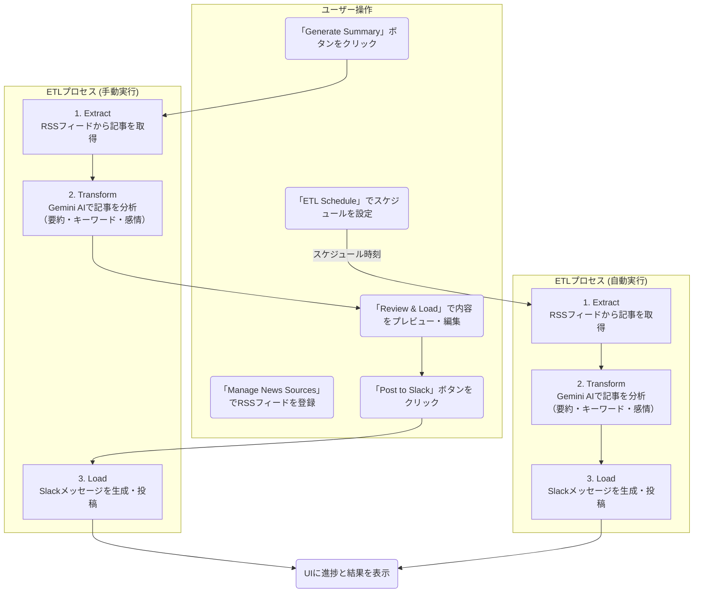

# AI ETL Agent: News to Slack

このアプリケーションは、ニュース記事を取得し、Gemini AI を使って分析・要約し、その結果をSlackに投稿する、という一連のETL (Extract, Transform, Load) プロセスを可視化するためのデモアプリケーションです。

**[ここに新しいUIのスクリーンショットを挿入]**

## 概要

「Generate Summary」ボタンをクリックすると、以下の処理が実行され、各ステップの進捗と結果がリアルタイムで画面に表示されます。また、生成された内容はSlackに投稿する前にリッチなUIで確認・編集が可能です。
さらに、ETLプロセスを定期的に自動実行するスケジュール機能も備えています。

1.  **Extract (抽出)**: 登録されたRSSフィードからニュース記事を取得します。
2.  **Transform (変換)**: Google Gemini API を利用して、取得したニュース記事を分析し、「**要約**」「**キーワード抽出**」「**感情分析**」を日本語で生成します。
3.  **Review (確認)**: 生成された内容をSlackに投稿する前に、専用のUIで確認・編集できます。
4.  **Load (書き出し)**: 分析結果をSlackのメッセージ形式に整形し、実際にSlackチャンネルに投稿します。

## 機能

-   **ニュースソース管理**: Web UIからRSSフィードのURLを登録・削除できます。
-   **高度なAI分析とSlack投稿**:
    -   登録されたRSSフィードからニュースを取得し、Gemini AIが「要約」「キーワード」「感情」を抽出します。
    -   記事のタイトルはクリック可能なリンクとしてSlackに投稿され、各記事は区切り線で分かりやすく分割されます。
-   **リッチなレビュー画面**:
    -   分析結果を、キーワードのタグ表示や感情のアイコン表示など、見やすいカード形式でプレビューできます。
    -   「Edit Raw Text」ボタンを押すことで、Slackに投稿するテキスト全体を直接編集することも可能です。
-   **定期実行スケジューラー**: ETLプロセスを「毎日朝9時」や「1時間ごと」のように、指定したスケジュールで自動実行できます。
-   **エラーハンドリング**: 無効なRSSフィードが登録されている場合、Extract処理でエラーを検出し、処理を中断して画面にエラーメッセージを表示します。

## 処理フロー



## 主な使用技術

-   **フロントエンド**: React, TypeScript
-   **バックエンド**: Node.js (Express), TypeScript
-   **ビルドツール**: Vite
-   **AI**: Google Gemini API (`@google/genai`)
-   **UI**: Tailwind CSS (CDN)

## ローカルでの実行方法

**前提条件:**

-   [Node.js](https://nodejs.org/) がインストールされていること。
-   Google Gemini API キーを取得していること。
-   Slack Webhook URL を取得していること。

**手順:**

1.  **依存関係のインストール:**
    プロジェクトのルートと`server`ディレクトリの両方で依存関係をインストールします。
    ```bash
    # フロントエンド
    npm install

    # バックエンド
    cd server
    npm install
    ```

2.  **APIキーとWebhook URLの設定:**
    `server`ディレクトリに `.env` ファイルを作成し、以下のようにご自身のGemini APIキーとSlack Webhook URLを設定してください。
    
    ```sh
    # server/.env
    GEMINI_API_KEY=YOUR_GEMINI_API_KEY
    SLACK_WEBHOOK_URL=YOUR_SLACK_WEBHOOK_URL
    ```

3.  **開発サーバーの起動:**
    **2つのターミナル**で、それぞれフロントエンドとバックエンドのサーバーを起動します。

    **ターミナル1 (フロントエンド):**
    ```bash
    npm run dev
    ```

    **ターミナル2 (バックエンド):**
    ```bash
    cd server
    npm run dev
    ```

4.  ブラウザで `http://localhost:3000` （またはターミナル1に表示されたアドレス）にアクセスすると、アプリケーションが表示されます。

**【重要】スケジュール機能をご利用の場合の注意点:**
スケジュール機能でETLプロセスを自動実行させるためには、**上記の手順で起動したバックエンドサーバー（ターミナル2）を常に起動中にしておく必要があります。** フロントエンド（ブラウザの画面）は閉じていても問題ありませんが、バックエンドサーバーが停止していると、スケジュールされたタスクは実行されません。