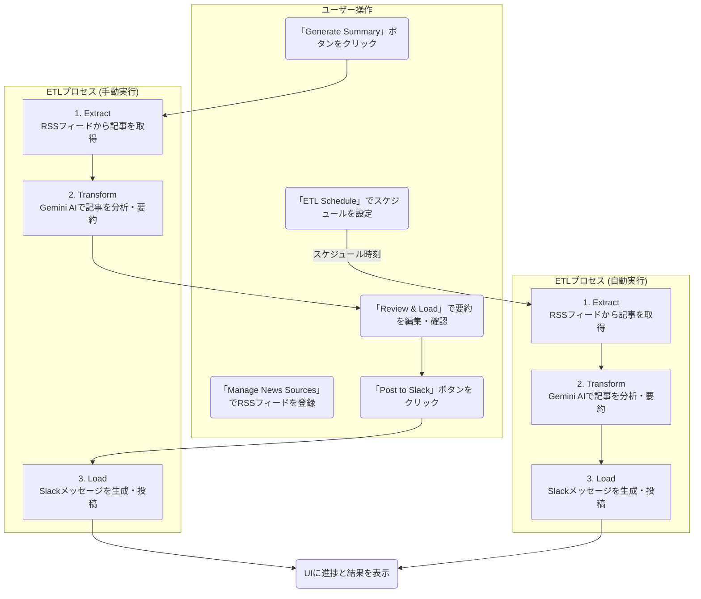

<div align="center">

</div>

# AI ETL Agent: News to Slack

このアプリケーションは、ニュース記事を取得し、Gemini AI を使って分析・要約し、その結果をSlackに投稿する、という一連のETL (Extract, Transform, Load) プロセスを可視化するためのデモアプリケーションです。

AI Studioでこのアプリを見る: https://ai.studio/apps/drive/11Vwu7xVOHsMmfslq1c8vJMcJj_0enz-P

## 概要

「Generate Summary」ボタンをクリックすると、以下の処理が実行され、各ステップの進捗と結果がリアルタイムで画面に表示されます。また、生成された要約はSlackに投稿する前に確認・編集が可能です。
さらに、ETLプロセスを定期的に自動実行するスケジュール機能も追加されました。

1.  **Extract (抽出)**: **登録されたRSSフィードからニュース記事を取得**します。
2.  **Transform (変換)**: Google Gemini API を利用して、取得したニュース記事を分析し、「トピック分類」と「内容の要約」を生成します。
3.  **Review (確認)**: 生成された要約をSlackに投稿する前に、内容を確認・編集できます。
4.  **Load (書き出し)**: 分析結果をSlackのメッセージ形式に整形し、**実際にSlackチャンネルに投稿**します。

## 機能

-   **ニュースソース管理**: Web UIからRSSフィードのURLを登録・削除できます。
-   **要約生成とSlack投稿**: 登録されたRSSフィードからニュースを取得し、Gemini AIで処理後、**Slack投稿前に要約内容をプレビュー・編集**し、Slackに投稿します。
-   **定期実行スケジューラー**: ETLプロセスを「毎日朝9時」や「1時間ごと」のように、**指定したスケジュールで自動実行**できます。
-   **エラーハンドリング**: 無効なRSSフィードが登録されている場合、Extract処理でエラーを検出し、処理を中断して画面にエラーメッセージを表示します。

## 処理フロー



## 主な使用技術

-   **フロントエンド**: React, TypeScript
-   **バックエンド**: Node.js (Express), TypeScript
-   **ビルドツール**: Vite
-   **AI**: Google Gemini API (`@google/genai`)
-   **UI**: Tailwind CSS (CDN)

## ローカルでの実行方法

**前提条件:**

-   [Node.js](https://nodejs.org/) がインストールされていること。
-   Google Gemini API キーを取得していること。
-   Slack Webhook URL を取得していること。

**手順:**

1.  **依存関係のインストール:**
    プロジェクトのルートと`server`ディレクトリの両方で依存関係をインストールします。
    ```bash
    # フロントエンド
    npm install

    # バックエンド
    cd server
    npm install
    npm install -D tsconfig-paths # tsconfig-paths のインストールも必要です
    cd ..
    ```

2.  **APIキーとWebhook URLの設定:**
    `server`ディレクトリに `.env` ファイルを作成し、以下のようにご自身のGemini APIキーとSlack Webhook URLを設定してください。
    
    ```sh
    # server/.env
    GEMINI_API_KEY=YOUR_GEMINI_API_KEY
    SLACK_WEBHOOK_URL=YOUR_SLACK_WEBHOOK_URL
    ```

3.  **開発サーバーの起動:**
    **2つのターミナル**で、それぞれフロントエンドとバックエンドのサーバーを起動します。

    **ターミナル1 (フロントエンド):**
    ```bash
    npm run dev
    ```

    **ターミナル2 (バックエンド):**
    ```bash
    cd server
    npm run dev
    ```
    **注意**: バックエンドの `npm run dev` コマンドは、`tsconfig-paths` を使用するため、`nodemon --exec ts-node -r tsconfig-paths/register src/index.ts` となります。

4.  ブラウザで `http://localhost:3000` （またはターミナル1に表示されたアドレス）にアクセスすると、アプリケーションが表示されます。

---