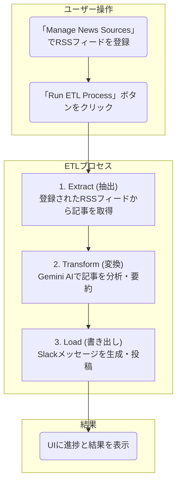

<div align="center">

</div>

# AI ETL Agent: News to Slack

このアプリケーションは、ニュース記事を取得し、Gemini AI を使って分析・要約し、その結果をSlackに投稿する、という一連のETL (Extract, Transform, Load) プロセスを可視化するためのデモアプリケーションです。

AI Studioでこのアプリを見る: https://ai.studio/apps/drive/11Vwu7xVOHsMmfslq1c8vJMcJj_0enz-P

## 概要

「Run ETL Process」ボタンをクリックすると、以下の処理が実行され、各ステップの進捗と結果がリアルタイムで画面に表示されます。

1.  **Extract (抽出)**: **登録されたRSSフィードからニュース記事を取得**します。
2.  **Transform (変換)**: Google Gemini API を利用して、取得したニュース記事を分析し、「トピック分類」と「内容の要約」を生成します。
3.  **Load (書き出し)**: 分析結果をSlackのメッセージ形式に整形し、**実際にSlackチャンネルに投稿**します。

## 機能

-   **ニュースソース管理**: Web UIからRSSフィードのURLを登録・削除できます。
-   **ETLプロセス実行**: 登録されたRSSフィードからニュースを取得し、Gemini AIで処理後、Slackに投稿します。
-   **エラーハンドリング**: 無効なRSSフィードが登録されている場合、Extract処理でエラーを検出し、処理を中断して画面にエラーメッセージを表示します。

## 処理フロー



## 主な使用技術

-   **フロントエンド**: React, TypeScript
-   **バックエンド**: Node.js (Express), TypeScript
-   **ビルドツール**: Vite
-   **AI**: Google Gemini API (`@google/genai`)
-   **UI**: Tailwind CSS

## ローカルでの実行方法

**前提条件:**

-   [Node.js](https://nodejs.org/) がインストールされていること。
-   Google Gemini API キーを取得していること。
-   Slack Webhook URL を取得していること。

**手順:**

1.  **依存関係のインストール:**
    プロジェクトのルートと`server`ディレクトリの両方で依存関係をインストールします。
    ```bash
    # フロントエンド
    npm install

    # バックエンド
    cd server
    npm install
    npm install -D tsconfig-paths # tsconfig-paths のインストールも必要です
    cd ..
    ```

2.  **APIキーとWebhook URLの設定:**
    `server`ディレクトリに `.env` ファイルを作成し、以下のようにご自身のGemini APIキーとSlack Webhook URLを設定してください。
    
    ```sh
    # server/.env
    GEMINI_API_KEY=YOUR_GEMINI_API_KEY
    SLACK_WEBHOOK_URL=YOUR_SLACK_WEBHOOK_URL
    ```

3.  **開発サーバーの起動:**
    **2つのターミナル**で、それぞれフロントエンドとバックエンドのサーバーを起動します。

    **ターミナル1 (フロントエンド):**
    ```bash
    npm run dev
    ```

    **ターミナル2 (バックエンド):**
    ```bash
    cd server
    npm run dev
    ```
    **注意**: バックエンドの `npm run dev` コマンドは、`tsconfig-paths` を使用するため、`nodemon --exec ts-node -r tsconfig-paths/register src/index.ts` となります。

4.  ブラウザで `http://localhost:5173` （またはターミナル1に表示されたアドレス）にアクセスすると、アプリケーションが表示されます。

---

## 開発メモ (Development Memo)

開発の進捗と計画を記録するためのメモです。

### 完了したタスク (2025-10-11)

-   **ニュースソース管理機能の追加**: Web UIからRSSフィードのURLを登録・削除できるようになりました。
-   **UI改善**: 「Add Source」ボタンの視認性を向上させました。
-   **エラーハンドリング強化**: 無効なRSSフィードが登録された場合、Extract処理でエラーを検出し、処理を中断して画面にエラーメッセージを表示するようになりました。
-   **コードのリファクタリング**: 
    -   サーバーサイドのロジックを `services` と `routes` ディレクトリに分割し、`index.ts` をクリーンにしました。
    -   フロントエンドのAPI呼び出しロジックを `services/newsSourceService.ts` に分離しました。
    -   サーバーとフロントエンドで重複していた型定義をプロジェクトルートの `types.ts` に統合し、`tsconfig.json` の `paths` エイリアスを使って参照するようにしました。


### 完了したタスク (2025-10-10)

- **ETL処理のバックエンドへの移設:**
  - `services/geminiService.ts` で行われていたGemini APIの呼び出し処理を、`server/src/index.ts` の `/api/run-etl` エンドポイントに完全に移設しました。
  - これにより、APIキーがフロントエンドから漏洩するリスクがなくなり、セキュリティが向上しました。
- **フロントエンドのAPI呼び出し修正:**
  - `services/geminiService.ts` を修正し、バックエンドの `/api/run-etl` を呼び出すように変更しました。
- **Extract処理の動的化:**
  - Yahoo!ニュースのRSSフィードから最新のニュースを動的に取得するように `server/src/index.ts` を修正しました。
- **Load処理の実際のSlack投稿化:**
  - Geminiが生成したメッセージを、設定されたSlack Webhook URLへ実際に投稿するように `server/src/index.ts` を修正しました。
- **ドキュメント更新:**
  - ローカルでの実行方法（`README.md`）を、現在のフロントエンド＋バックエンドの構成に合わせて更新しました。
- **コードのリファクタリング:**
  - `server/src/constants.ts` から不要なモックデータを削除しました。
  - `server/src/index.ts` および `services/geminiService.ts` の冗長なログやコメントを整理し、コードを簡潔にしました。

### 完了したタスク (2025-10-09)

- **バックエンドサーバーの導入:**
  - セキュリティ強化と将来の機能拡張のため、Node.js (Express + TypeScript) を使用したバックエンドサーバーの雛形を `server` ディレクトリに構築しました。